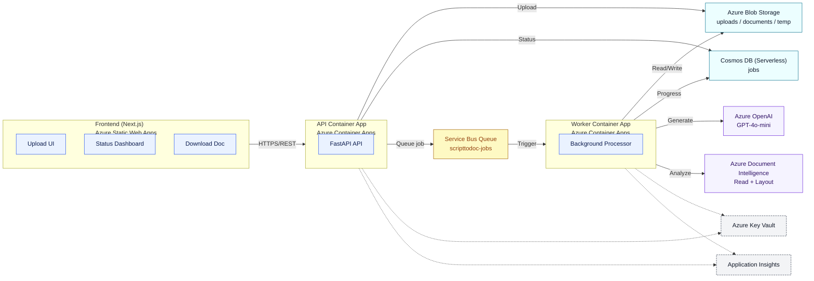
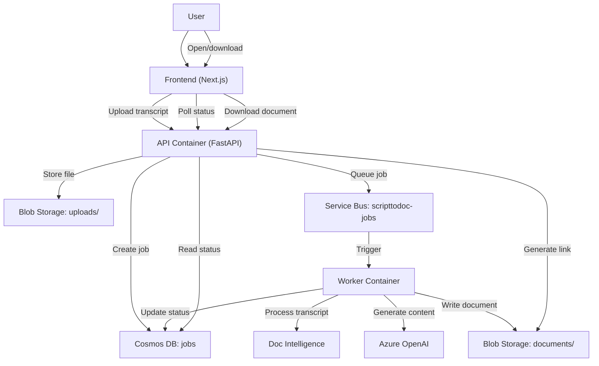

## Architecture Diagram (Mermaid)

```mermaid
flowchart LR
  %% Style
  classDef app fill:#EAF2FF,stroke:#2F5BEA,stroke-width:1px,color:#0B1B4D;
  classDef service fill:#F5F7FA,stroke:#6B7280,stroke-width:1px,color:#111827;
  classDef storage fill:#ECFEFF,stroke:#0E7490,stroke-width:1px,color:#0F172A;
  classDef queue fill:#FEF9C3,stroke:#A16207,stroke-width:1px,color:#92400E;
  classDef ai fill:#F5F3FF,stroke:#6D28D9,stroke-width:1px,color:#2E1065;
  classDef support fill:#F3F4F6,stroke:#374151,stroke-width:1px,color:#111827,stroke-dasharray: 4 2;

  %% Client tier
  subgraph FE["Frontend (Next.js)<br/>Azure Static Web Apps"]
    FE_UI["Upload UI"]:::app
    FE_STATUS["Status Dashboard"]:::app
    FE_DL["Download Doc"]:::app
  end

  %% API tier
  subgraph API["API Container App<br/>Azure Container Apps"]
    API_APP["FastAPI API"]:::app
  end

  %% Core services
  BLB["Azure Blob Storage<br/>uploads / documents / temp"]:::storage
  COS["Cosmos DB (Serverless)<br/>jobs"]:::storage
  SB["Service Bus Queue<br/>scripttodoc-jobs"]:::queue

  %% Worker tier
  subgraph WRK["Worker Container App<br/>Azure Container Apps"]
    WRK_PROC["Background Processor"]:::app
  end

  %% AI services
  OPENAI["Azure OpenAI<br/>GPT-4o-mini"]:::ai
  DOCINT["Azure Document Intelligence<br/>Read + Layout"]:::ai

  %% Supporting services
  KV["Azure Key Vault"]:::support
  AI["Application Insights"]:::support

  %% Primary flow
  FE -->|HTTPS/REST| API
  API -->|Upload| BLB
  API -->|Status| COS
  API -->|Queue job| SB

  SB -->|Trigger| WRK
  WRK -->|Read/Write| BLB
  WRK -->|Progress| COS
  WRK -->|Generate| OPENAI
  WRK -->|Analyze| DOCINT

  %% Cross‑cutting
  API -.-> KV
  WRK -.-> KV
  API -.-> AI
  WRK -.-> AI
```

## User Flow (Mermaid)

```mermaid
flowchart TB
  U["User"] --> FE["Frontend (Next.js)"]
  FE -->|Upload transcript| API["API Container (FastAPI)"]
  API -->|Store file| BLB["Blob Storage: uploads/"]
  API -->|Create job| COS["Cosmos DB: jobs"]
  API -->|Queue job| SB["Service Bus: scripttodoc-jobs"]

  SB -->|Trigger| WRK["Worker Container"]
  WRK -->|Process transcript| DOCINT["Doc Intelligence"]
  WRK -->|Generate content| OPENAI["Azure OpenAI"]
  WRK -->|Write document| BLB_DOC["Blob Storage: documents/"]
  WRK -->|Update status| COS

  FE -->|Poll status| API
  API -->|Read status| COS
  FE -->|Download document| API
  API -->|Generate link| BLB_DOC
  U -->|Open/download| FE
```
