# ScriptToDoc Data Flow Diagram (Revised)

**Version:** 2.0 - Post Bing Removal
**Last Updated:** 2025-11-25
**Status:** Reflects actual implementation, highlights confidence issues

This diagram shows the real data flow through the system, where transformations occur, and where confidence/quality issues arise.

---

## Current Data Flow (Actual Implementation)

```mermaid
flowchart TD
    subgraph Input["📥 Input Phase"]
        A1[User Uploads File<br/>.txt or .pdf] --> A2[File Content<br/>binary data]
        A3[User Config<br/>tone, audience, target_steps<br/>knowledge_urls] --> A4[Config Dict]
    end

    subgraph Extraction["📄 Text Extraction Phase"]
        A2 --> B1{File Type?}
        B1 -->|.txt| B2[UTF-8 Decode<br/>fallback: latin-1, cp1252]
        B1 -->|.pdf| B3[pypdf Extract<br/>page-by-page concatenation]
        B2 --> B4[Raw Text String<br/>may contain fillers, timestamps]
        B3 --> B4
    end

    subgraph Storage["💾 Initial Storage Phase"]
        B4 --> C1[Azure Blob Storage<br/>uploads/job_id/transcript.txt<br/>UTF-8 encoded]
        A4 --> C2[Cosmos DB Job Record<br/>status: queued<br/>config + metadata]
        C1 -.blob URL.-> C2
    end

    subgraph Processing["⚙️ Processing Pipeline Phase"]
        C1 --> D1[Download from Blob<br/>retrieve text]

        D1 --> D2[Clean Text<br/>normalize whitespace<br/>remove filler words<br/>fix punctuation]
        D2 --> D3[Sentence Tokenization<br/>NLTK sentence splitter]
        D3 --> D4[Sentence Catalog<br/>list of 100-500 sentences<br/>⚠️ CRITICAL for source matching]

        A4 -.knowledge_urls.-> D5{Knowledge URLs<br/>provided?}
        D5 -->|Yes| D6[Fetch Knowledge<br/>HTTP requests<br/>parse HTML/PDF<br/>cache 24h]
        D5 -->|No| D7[Empty List]
        D6 --> D8[Knowledge Sources<br/>list of dicts with<br/>url, title, content, type]
        D7 --> D8

        D2 --> D9{Azure DI<br/>enabled?}
        D9 -->|Yes| D10[Azure DI Analysis<br/>extract actions, roles<br/>sequence indicators<br/>2-10s processing]
        D9 -->|No| D11[Empty Structure<br/>fallback dict]
        D10 --> D12[DI Structure<br/>actions, decisions, roles]
        D11 --> D12

        D2 --> D13[Calculate Complexity<br/>action_count<br/>word_count<br/>decision_count]
        D12 -.actions, decisions.-> D13

        D13 --> D14[Suggest Step Count<br/>OpenAI optional<br/>apply min/max bounds]
        D14 --> D15[Target Step Count<br/>integer 3-15]

        D2 --> D16[🤖 Generate Steps<br/>Azure OpenAI GPT-4o-mini<br/>⚠️ PRIMARY QUALITY BOTTLENECK]
        D12 -.structure context.-> D16
        D8 -.knowledge context.-> D16
        D15 -.target count.-> D16
        D16 --> D17[Generated Steps<br/>list of step dicts<br/>title, summary, details, actions<br/>⚠️ May not match transcript verbatim]

        D17 --> D18[⚡ Enhance Steps<br/>add transcript excerpts<br/>improve source matching<br/>⚠️ POST-generation fix]
        D4 -.sentences.-> D18
        D18 --> D19[Enhanced Steps<br/>steps + transcript_content field]

        D19 --> D20[🔍 Match Sources<br/>word overlap + keyword + phrase<br/>⚠️ CONFIDENCE BOTTLENECK]
        D4 -.sentence catalog.-> D20
        D8 -.knowledge sources.-> D20
        D20 --> D21[Steps with Sources<br/>each step has:<br/>- sources list<br/>- overall_confidence 0.0-1.0<br/>⚠️ Often LOW scores]

        D21 --> D22[✅ Validate Steps<br/>filter by confidence ≥ 0.4<br/>relax to 0.3 if sources exist<br/>⚠️ May reject many steps]
        D22 --> D23[Valid Steps<br/>filtered list<br/>⚠️ May be 50-70% of generated]
    end

    subgraph Document["📝 Document Generation Phase"]
        D23 --> E1[Create Word Doc<br/>python-docx<br/>title page + steps<br/>source citations<br/>statistics]
        E1 --> E2[.docx File<br/>50KB - 2MB<br/>professional format]
    end

    subgraph FinalStorage["💾 Final Storage Phase"]
        E2 --> F1[Upload to Blob<br/>documents/job_id/doc.docx]
        D23 -.metrics.-> F2[Calculate Metrics<br/>total_steps<br/>avg_confidence<br/>processing_time<br/>token_usage]
        F1 --> F3[Update Cosmos DB<br/>status: completed<br/>result blob_path + metrics]
    end

    subgraph Output["📤 Output to User"]
        F3 --> G1[Frontend Polls<br/>GET /api/status/job_id<br/>every 2-3 seconds]
        G1 --> G2[Job Status Response<br/>progress, stage, result]
        G2 --> G3[Generate Download URL<br/>SAS token 1h expiry]
        G3 --> G4[User Downloads<br/>.docx file]
    end

    style A1 fill:#2563eb,stroke:#1e40af,stroke-width:3px,color:#fff
    style D16 fill:#dc2626,stroke:#991b1b,stroke-width:3px,color:#fff
    style D20 fill:#dc2626,stroke:#991b1b,stroke-width:3px,color:#fff
    style D22 fill:#f59e0b,stroke:#d97706,stroke-width:3px,color:#fff
    style E2 fill:#16a34a,stroke:#15803d,stroke-width:2px,color:#fff
    style G4 fill:#16a34a,stroke:#15803d,stroke-width:2px,color:#fff
```



**Legend:**
- 🔴 Red = Critical quality/confidence bottleneck
- 🟡 Yellow = Warning/filtering point
- 🟢 Green = Success output

---

## Critical Issues Affecting Confidence & Performance

### 🔴 Issue 1: LLM Generation Quality (Step D16)

**Problem:** The LLM generates steps that don't match transcript verbatim

**Why it happens:**
- Prompt is very long and complex (multi-phase chain-of-thought)
- LLM paraphrases instead of quoting transcript directly
- LLM uses synonyms and generic terminology
- LLM may hallucinate details not in transcript

**Impact:**
- Steps use different wording than transcript sentences
- Word overlap scoring drops to 0.2-0.4 range
- Final confidence scores are 0.3-0.5 (below 0.6 threshold)

**Example:**
```
Transcript: "Click on the 'Create a resource' button in the Azure portal"
LLM Output: "Navigate to resource creation in the portal"
Confidence: 0.25 (low word overlap: "portal" is only match)
```

**Solution Approaches:**
1. **Simplify the prompt** - Remove complex chain-of-thought, focus on quoting
2. **Require direct quotes** - Instruct LLM to include verbatim transcript excerpts
3. **Provide context chunks** - Give LLM specific transcript sections for each step
4. **Use structured output** - Force LLM to include "transcript_quote" field

---

### 🔴 Issue 2: Source Matching Algorithm (Step D20)

**Problem:** Word-overlap matching is too simplistic for semantic similarity

**Current Algorithm:**
```python
# Jaccard similarity (word overlap)
word_overlap = len(step_words ∩ sentence_words) / len(step_words ∪ sentence_words)
base_score = word_overlap * 0.4 + keyword_score * 0.3 + phrase_score * 0.2 + char_similarity * 0.1
```

**Why it fails:**
- **Paraphrasing:** "Create resource" vs "Create a resource" = low overlap
- **Synonyms:** "Navigate" vs "Go to" = 0 overlap
- **Word order:** "portal Azure" vs "Azure portal" = same overlap but different meaning
- **Stop words removed:** "the", "a", "in" = reduces meaningful context

**Impact:**
- Semantic matches score low (0.15-0.3)
- Only exact phrase matches score high (0.6+)
- Many legitimate sources rejected

**Example Mismatch:**
```
Step: "Configure the storage account settings"
Sentence: "Go to settings and configure your storage"
Word overlap: {configure, storage, settings} = 3/6 = 0.5
Keyword score: 2/3 = 0.67
Final score: 0.5*0.4 + 0.67*0.3 = 0.40 ← Just above threshold!
```

**Solution Approaches:**
1. **Semantic embeddings** - Use sentence-transformers for cosine similarity
2. **Fuzzy matching** - Allow character-level edit distance (Levenshtein)
3. **Phrase matching** - Detect n-gram overlaps, not just word sets
4. **Context-aware** - Consider surrounding sentences for context

---

### 🟡 Issue 3: Validation Threshold Too Strict (Step D22)

**Problem:** Threshold of 0.4 (relaxed to 0.3) may filter good steps

**Why it's problematic:**
- Multiplicative confidence scoring compounds uncertainty
- Average confidence with 3 sources at 0.5 each → 0.5 * 1.15 = 0.575
- If LLM paraphrases slightly → sources score 0.3-0.4 → overall 0.35 ← rejected

**Current Validation:**
```python
# Accept if confidence ≥ 0.4 OR (confidence ≥ 0.3 AND has sources)
meets_threshold = confidence >= 0.4
has_sources = len(sources) > 0
accept = meets_threshold or (has_sources and confidence >= 0.3)
```

**Impact:**
- 30-50% of generated steps rejected
- User gets 5-7 steps instead of 10-12
- Quality may be artificially limited

**Solution Approaches:**
1. **Lower threshold** - Try 0.25 as minimum (but risk poor quality)
2. **Graduated acceptance** - Accept more sources per step, average them
3. **Manual review option** - Show rejected steps with warning badges
4. **Improve upstream** - Fix generation and matching, keep threshold high

---

### ⚠️ Issue 4: Enhancement Happens Too Late (Step D18)

**Problem:** Transcript excerpts added AFTER generation, not DURING

**Current Flow:**
1. LLM generates steps (without seeing full transcript context)
2. Enhancement adds transcript_content field to each step
3. Source matching uses enhanced content

**Why it's suboptimal:**
- LLM doesn't know what transcript content to reference
- Enhancement is reactive, not proactive
- Mismatch between what LLM generated and what transcript says

**Better Flow:**
1. Extract relevant transcript chunks FIRST
2. Give LLM those chunks to reference during generation
3. LLM includes direct quotes in output
4. Source matching finds exact matches

**Solution:**
- Move enhancement to PRE-generation
- Create "grounding chunks" from transcript
- Pass chunks to LLM as context

---

## Data Flow Metrics (Real World)

### Input Phase
- File size: 10 KB - 5 MB
- Extraction time: 0.1-1s
- Text length: 1,000 - 50,000 words

### Processing Phase
- Cleaning time: 0.1-0.5s
- Sentence count: 50-500 sentences
- Knowledge fetch: 2-8s per URL (if provided)
- Azure DI: 2-10s (if enabled)
- **LLM generation: 10-30s** ⚠️ SLOW
- **Source matching: 2-8s** ⚠️ CAN BE SLOW
- Validation: <0.1s

### Output Phase
- Document generation: 0.5-2s
- Upload: 0.2-1s
- **Total pipeline: 15-50s**

### Quality Metrics (Current Issues)
- **Average confidence: 0.45-0.65** ⚠️ BELOW DESIRED 0.7+
- **Step acceptance rate: 60-80%** ⚠️ LOSING 20-40% OF STEPS
- **Sources per step: 2-4** ← Decent
- **Token usage: 3,000-8,000 tokens** ← Expensive for quality achieved

---

## Recommended Architecture Changes

### Priority 1: Improve LLM Grounding

**Change:** Provide transcript chunks to LLM during generation

```python
# Current (bad):
steps = llm.generate(transcript=full_transcript, target_steps=8)
enhanced_steps = enhance_with_excerpts(steps, sentences)  # Too late!

# Proposed (better):
chunks = extract_relevant_chunks(full_transcript, num_chunks=target_steps)
steps = llm.generate(
    chunks=chunks,  # Give LLM specific context
    instruction="For each chunk, create a step using EXACT quotes from that chunk"
)
# No enhancement needed - steps already grounded!
```

### Priority 2: Simplify LLM Prompt

**Current:** 100+ line chain-of-thought prompt with multiple phases

**Proposed:** Short, direct prompt focused on grounding
```
You are creating training documentation from a transcript.

CRITICAL RULES:
1. Use EXACT phrases from the transcript - DO NOT paraphrase
2. Include direct quotes in every step
3. Use the same terminology, button names, and URLs as the transcript
4. If you cannot quote the transcript directly, skip that content

For each step, provide:
- title: Short title using exact transcript terminology
- summary: 1-2 sentences with direct transcript quotes
- details: Specific actions using exact wording from transcript
- actions: List of action verbs from transcript

Transcript chunk for this step:
{chunk}

Now create the step:
```

### Priority 3: Better Source Matching

**Option A: Semantic Embeddings (Recommended)**
```python
# Use sentence-transformers for semantic similarity
from sentence_transformers import SentenceTransformer

model = SentenceTransformer('all-MiniLM-L6-v2')
step_embedding = model.encode(step_content)
sentence_embeddings = model.encode(sentences)
similarities = cosine_similarity([step_embedding], sentence_embeddings)[0]
# similarities is 0.0-1.0, captures semantic meaning
```

**Benefits:**
- Captures synonyms and paraphrasing
- Faster than word-by-word comparison
- More accurate confidence scores

**Option B: Hybrid Approach**
```python
# Combine exact matching + semantic similarity
exact_score = word_overlap_score(step, sentence)  # 0.0-1.0
semantic_score = embedding_similarity(step, sentence)  # 0.0-1.0
final_score = (exact_score * 0.6) + (semantic_score * 0.4)
```

### Priority 4: Adjust Confidence Thresholds

**Current:** 0.4 overall (relaxed to 0.3)

**Proposed:** Graduated thresholds based on quality indicators
```python
if source_count >= 4 and avg_confidence >= 0.5:
    threshold = 0.35  # Multiple good sources
elif source_count >= 2 and avg_confidence >= 0.6:
    threshold = 0.40  # Fewer but high-quality sources
elif source_count >= 1 and avg_confidence >= 0.7:
    threshold = 0.50  # Single excellent source
else:
    threshold = 0.60  # Low confidence needs boosting
```

---

## Data Validation Rules (Updated)

### Input Validation
- ✅ File size: ≤ 5 MB (configurable)
- ✅ File type: .txt or .pdf only
- ✅ Config: 3 ≤ target_steps ≤ 15
- ✅ Knowledge URLs: Valid HTTP/HTTPS (optional)

### Processing Validation
- ✅ Transcript: > 50 characters (minimum viable)
- ⚠️ Step generation: Must produce ≥ 1 step
- ⚠️ Source matching: Each step should have ≥ 1 source (relaxed)
- ⚠️ Confidence: **Currently too many steps fail validation**

### Output Validation
- ✅ Document: Valid .docx format
- ✅ Blob: Accessible SAS URL
- ✅ Metrics: All fields present and valid
- ✅ Status: One of queued|processing|completed|failed

---

## Storage Requirements

### Per Job
- Transcript blob: 10 KB - 5 MB
- Document blob: 50 KB - 2 MB
- Cosmos DB record: ~3-8 KB
- **Total: ~10-20 MB per job**

### Retention
- Active jobs: Indefinite
- Completed jobs: 30 days (configurable)
- Failed jobs: 7 days (for debugging)

---

## Potential Data Issues (Known)

### ✅ Issue 1: Orphaned Jobs
**Status:** HANDLED
**Solution:** Blob existence verified before job creation

### ✅ Issue 2: Stale Status
**Status:** HANDLED
**Solution:** Atomic Cosmos DB updates with retries

### 🔴 Issue 3: Low Confidence Scores
**Status:** ACTIVE ISSUE
**Impact:** 40-60% confidence when target is 70%+
**See:** Issues #1-4 above for root causes and solutions

### 🟡 Issue 4: Step Rejection Rate
**Status:** ACTIVE ISSUE
**Impact:** 20-40% of generated steps rejected
**Cause:** Threshold too strict given current matching algorithm

### 🟡 Issue 5: LLM Performance
**Status:** ACTIVE ISSUE
**Impact:** Steps don't quote transcript verbatim
**Cause:** Prompt complexity and lack of grounding chunks

---

## Next Steps for Improvement

1. **Immediate (Week 1):**
   - Simplify LLM prompt (remove chain-of-thought)
   - Add "require direct quotes" instruction
   - Lower confidence threshold to 0.3 temporarily

2. **Short-term (Week 2-3):**
   - Implement chunk-based grounding (pre-generation)
   - Test semantic embedding matching (sentence-transformers)
   - A/B test different prompts

3. **Medium-term (Month 1-2):**
   - Replace word-overlap with hybrid exact+semantic matching
   - Implement graduated confidence thresholds
   - Add user feedback on step quality

4. **Long-term (Month 3+):**
   - Fine-tune custom model on good transcript→step examples
   - Implement active learning from user corrections
   - Add manual step editing interface

---

**Document Version:** 2.0
**Last Reviewed:** 2025-11-25
**Status:** ⚠️ Reflects current issues - improvements needed
