# ScriptToDoc Processing Flow Diagram

This document contains a comprehensive Mermaid diagram showing the complete flow from file upload through Azure AI/OpenAI processing to document generation.

## Complete Processing Flow

```mermaid
flowchart TD
    Start([User Uploads File<br/>.txt or .pdf]) --> Frontend[Frontend: UploadForm]
    
    Frontend --> ValidateFile{Validate File<br/>Size & Type}
    ValidateFile -->|Invalid| Error1[Return Error to User]
    ValidateFile -->|Valid| CreateFormData[Create FormData<br/>with file + config]
    
    CreateFormData --> APIRequest[POST /api/process<br/>with multipart/form-data]
    
    APIRequest --> BackendAPI[Backend API:<br/>process_transcript endpoint]
    
    BackendAPI --> ReadFile[Read File Content<br/>from UploadFile]
    ReadFile --> CheckSize{File Size<br/>> Max?}
    CheckSize -->|Yes| Error2[HTTP 400:<br/>File too large]
    CheckSize -->|No| ExtractText[Extract Text:<br/>process_uploaded_file]
    
    ExtractText --> FileType{File Type?}
    FileType -->|.txt| DecodeTXT[Decode UTF-8<br/>or fallback encodings]
    FileType -->|.pdf| ExtractPDF[Extract Text from PDF<br/>using pypdf]
    
    DecodeTXT --> TextExtracted[Text Extracted]
    ExtractPDF --> TextExtracted
    
    TextExtracted --> GenerateJobID[Generate UUID<br/>Job ID]
    
    GenerateJobID --> UploadBlob[Upload to Azure Blob Storage<br/>Container: uploads<br/>Path: job_id/transcript.txt]
    
    UploadBlob --> CreateJobRecord[Create Job Record<br/>in Cosmos DB]
    
    CreateJobRecord --> JobRecord[Job Record:<br/>- status: queued<br/>- progress: 0<br/>- stage: pending<br/>- config: user settings]
    
    JobRecord --> ProcessingMode{Processing Mode?}
    
    ProcessingMode -->|Direct Processing<br/>use_direct_processing=true| DirectProcess[Start Background Thread<br/>process_job_direct]
    ProcessingMode -->|Service Bus| SendToQueue[Send Message to<br/>Azure Service Bus Queue]
    
    SendToQueue --> QueueSuccess{Queue<br/>Available?}
    QueueSuccess -->|No| FallbackDirect[Fallback to Direct Processing<br/>in background thread]
    QueueSuccess -->|Yes| QueueSent[Message Queued]
    
    DirectProcess --> WorkerStart[Background Worker Starts]
    FallbackDirect --> WorkerStart
    QueueSent --> WorkerListen[Worker Listens to Queue<br/>processor.py]
    WorkerListen --> WorkerStart
    
    WorkerStart --> UpdateStatus1[Update Job Status:<br/>status=processing<br/>progress=0.05<br/>stage=load_transcript]
    
    UpdateStatus1 --> DownloadTranscript[Download Transcript<br/>from Blob Storage]
    
    DownloadTranscript --> InitializePipeline[Initialize Pipeline:<br/>ScriptToDocPipeline]
    
    InitializePipeline --> InitComponents[Initialize Components:<br/>- TranscriptCleaner<br/>- SentenceTokenizer<br/>- SourceReferenceManager<br/>- AzureDocumentIntelligence<br/>- AzureOpenAIClient]
    
    InitComponents --> Stage1[Stage 1: Load Transcript<br/>progress=0.05]
    
    Stage1 --> CleanTranscript[Clean Transcript:<br/>- Normalize text<br/>- Remove filler words<br/>- Fix punctuation]
    
    CleanTranscript --> TokenizeSentences[Tokenize into Sentences<br/>Build Sentence Catalog]
    
    TokenizeSentences --> Stage2[Stage 2: Clean Transcript<br/>progress=0.15]
    
    Stage2 --> AzureDI{Azure DI<br/>Enabled?}
    
    AzureDI -->|Yes| AnalyzeDI[Azure Document Intelligence:<br/>- Analyze structure<br/>- Extract paragraphs<br/>- Identify actions/roles<br/>- Find sequence indicators]
    AzureDI -->|No| SkipDI[Skip Azure DI<br/>Use empty structure]
    
    AnalyzeDI --> ExtractStructure[Extract Process Structure:<br/>- Actions<br/>- Decisions<br/>- Roles<br/>- Sequence indicators]
    SkipDI --> ExtractStructure
    
    ExtractStructure --> Stage3[Stage 3: Azure DI Analysis<br/>progress=0.35]
    
    Stage3 --> DetermineSteps[Determine Optimal Step Count:<br/>- Analyze complexity<br/>- Count actions/decisions<br/>- Use OpenAI to suggest<br/>- Respect min/max bounds]
    
    DetermineSteps --> Stage4[Stage 4: Determine Steps<br/>progress=0.40]
    
    Stage4 --> CheckOpenAI{OpenAI<br/>Configured?}
    
    CheckOpenAI -->|No| ErrorOpenAI[Error: OpenAI Required<br/>Pipeline Fails]
    
    CheckOpenAI -->|Yes| CallAzureOpenAI[Call Azure OpenAI:<br/>generate_training_steps<br/>- Use GPT-4o-mini<br/>- Provide transcript<br/>- Provide DI structure<br/>- Target step count<br/>- Tone & audience]
    
    CallAzureOpenAI --> AzureSuccess{Azure OpenAI<br/>Success?}
    
    AzureSuccess -->|Yes| StepsGenerated[Training Steps Generated<br/>via Azure OpenAI]
    
    AzureSuccess -->|No| TryOpenAIFallback{OpenAI<br/>Fallback<br/>Available?}
    
    TryOpenAIFallback -->|No| ErrorBothFailed[Error: Both LLM Options Failed<br/>Pipeline Fails]
    
    TryOpenAIFallback -->|Yes| CallOpenAIFallback[Call Standard OpenAI:<br/>generate_training_steps<br/>- Use GPT-4o-mini<br/>- Same parameters]
    
    CallOpenAIFallback --> StepsGenerated[Training Steps Generated<br/>via OpenAI Fallback]
    
    StepsGenerated --> Stage5[Stage 5: Generate Steps<br/>progress=0.60]
    
    Stage5 --> BuildSources[Build Source References:<br/>For each step:<br/>- Match to transcript sentences<br/>- Calculate confidence scores<br/>- Find source locations]
    
    BuildSources --> Stage6[Stage 6: Build Sources<br/>progress=0.75]
    
    Stage6 --> ValidateSteps[Validate Steps:<br/>- Check source confidence<br/>- Verify source matches<br/>- Filter low-quality steps]
    
    ValidateSteps --> ValidSteps[Valid Steps List]
    
    ValidSteps --> Stage7[Stage 7: Validate Steps<br/>progress=0.85]
    
    Stage7 --> GenerateDocument[Generate Word Document:<br/>create_training_document<br/>- Create .docx file<br/>- Add title & metadata<br/>- Add steps with sources<br/>- Add statistics if enabled]
    
    GenerateDocument --> Stage8[Stage 8: Create Document<br/>progress=0.95]
    
    Stage8 --> UploadDocument[Upload Document to Blob Storage:<br/>Container: documents<br/>Path: job_id/training_document.docx]
    
    UploadDocument --> Stage9[Stage 9: Upload Document<br/>progress=0.95]
    
    Stage9 --> CalculateMetrics[Calculate Metrics:<br/>- Total steps<br/>- Average confidence<br/>- High confidence count<br/>- Processing time<br/>- Token usage]
    
    CalculateMetrics --> UpdateComplete[Update Job Status:<br/>status=completed<br/>progress=1.0<br/>stage=complete<br/>result=metrics + blob_path]
    
    UpdateComplete --> Stage10[Stage 10: Complete<br/>progress=1.0]
    
    Stage10 --> FrontendPoll[Frontend Polls Status:<br/>GET /api/status/job_id<br/>Every 2-3 seconds]
    
    FrontendPoll --> CheckStatus{Job<br/>Status?}
    
    CheckStatus -->|queued/processing| ShowProgress[Show Progress Tracker<br/>Display current stage<br/>Show progress bar]
    CheckStatus -->|completed| ShowResults[Show Document Results:<br/>- Download button<br/>- Preview link<br/>- Statistics<br/>- Metrics]
    CheckStatus -->|failed| ShowError[Show Error Message<br/>Display error details]
    
    ShowProgress --> FrontendPoll
    ShowResults --> End([User Downloads<br/>Document])
    ShowError --> End
    
    Error1 --> End
    Error2 --> End
    
    %% Error Handling Paths
    AnalyzeDI -.->|Error| SkipDI
    CallAzureOpenAI -.->|Error| TryOpenAIFallback
    CallOpenAIFallback -.->|Error| ErrorBothFailed
    ErrorBothFailed -.->|Pipeline Fails| UpdateFailed
    ErrorOpenAI -.->|Pipeline Fails| UpdateFailed
    ValidateSteps -.->|No Valid Steps| WarnEmpty[Warning:<br/>No valid steps<br/>Continue with 0 steps]
    WarnEmpty --> GenerateDocument
    
    GenerateDocument -.->|Error| UpdateFailed[Update Job Status:<br/>status=failed<br/>error=error_message]
    UpdateFailed --> FrontendPoll
    
    style Start fill:#2563eb,stroke:#1e40af,stroke-width:2px,color:#fff
    style End fill:#16a34a,stroke:#15803d,stroke-width:2px,color:#fff
    style Error1 fill:#dc2626,stroke:#b91c1c,stroke-width:2px,color:#fff
    style Error2 fill:#dc2626,stroke:#b91c1c,stroke-width:2px,color:#fff
    style ShowError fill:#dc2626,stroke:#b91c1c,stroke-width:2px,color:#fff
    style UpdateFailed fill:#dc2626,stroke:#b91c1c,stroke-width:2px,color:#fff
    style Stage1 fill:#f59e0b,stroke:#d97706,stroke-width:2px,color:#fff
    style Stage2 fill:#f59e0b,stroke:#d97706,stroke-width:2px,color:#fff
    style Stage3 fill:#f59e0b,stroke:#d97706,stroke-width:2px,color:#fff
    style Stage4 fill:#f59e0b,stroke:#d97706,stroke-width:2px,color:#fff
    style Stage5 fill:#f59e0b,stroke:#d97706,stroke-width:2px,color:#fff
    style Stage6 fill:#f59e0b,stroke:#d97706,stroke-width:2px,color:#fff
    style Stage7 fill:#f59e0b,stroke:#d97706,stroke-width:2px,color:#fff
    style Stage8 fill:#f59e0b,stroke:#d97706,stroke-width:2px,color:#fff
    style Stage9 fill:#f59e0b,stroke:#d97706,stroke-width:2px,color:#fff
    style Stage10 fill:#16a34a,stroke:#15803d,stroke-width:2px,color:#fff
    style AnalyzeDI fill:#3b82f6,stroke:#2563eb,stroke-width:2px,color:#fff
    style CallAzureOpenAI fill:#3b82f6,stroke:#2563eb,stroke-width:2px,color:#fff
    style CallOpenAIFallback fill:#3b82f6,stroke:#2563eb,stroke-width:2px,color:#fff
    style CheckOpenAI fill:#f59e0b,stroke:#d97706,stroke-width:2px,color:#fff
    style AzureSuccess fill:#f59e0b,stroke:#d97706,stroke-width:2px,color:#fff
    style TryOpenAIFallback fill:#f59e0b,stroke:#d97706,stroke-width:2px,color:#fff
    style ErrorOpenAI fill:#dc2626,stroke:#b91c1c,stroke-width:2px,color:#fff
    style ErrorBothFailed fill:#dc2626,stroke:#b91c1c,stroke-width:2px,color:#fff
    style UploadBlob fill:#a855f7,stroke:#9333ea,stroke-width:2px,color:#fff
    style UploadDocument fill:#a855f7,stroke:#9333ea,stroke-width:2px,color:#fff
    style CreateJobRecord fill:#a855f7,stroke:#9333ea,stroke-width:2px,color:#fff
```

## Processing Stages Breakdown

### Stage 1: Load Transcript (5%)
- Download transcript from Blob Storage
- Initialize pipeline components

### Stage 2: Clean Transcript (15%)
- Normalize text (remove extra spaces, fix punctuation)
- Remove filler words ("um", "uh", "like", etc.)
- Tokenize into sentences
- Build sentence catalog for source matching

### Stage 3: Azure DI Analysis (35%)
- **If enabled**: Analyze transcript with Azure Document Intelligence
  - Extract document structure
  - Identify actions, decisions, roles
  - Find sequence indicators
- **If disabled**: Use empty structure (fallback mode)

### Stage 4: Determine Steps (40%)
- Analyze complexity factors:
  - Action count from Azure DI
  - Decision count
  - Word count
- Use OpenAI to suggest optimal step count (if available)
- Respect min/max bounds from user config

### Stage 5: Generate Steps (60%)
- **Primary**: Use Azure OpenAI GPT-4o-mini
  - Generate structured training steps
  - Include titles, summaries, details, actions
  - Match to transcript content
- **Fallback**: If Azure OpenAI fails, use Standard OpenAI
  - Same GPT-4o-mini model
  - Same structured output
  - Maintains LLM quality
- **Error**: If both LLM options fail
  - Pipeline fails with clear error message
  - Job status set to failed
  - No degraded non-LLM fallback

### Stage 6: Build Sources (75%)
- For each generated step:
  - Match step content to transcript sentences
  - Calculate confidence scores
  - Find source locations (sentence indices)
  - Build source reference data

### Stage 7: Validate Steps (85%)
- Check source confidence scores
- Verify source matches are valid
- Filter out low-quality steps
- Accept steps based on threshold

### Stage 8: Create Document (95%)
- Generate Word document (.docx)
- Add document title and metadata
- Add validated steps with source citations
- Add statistics section (if enabled)

### Stage 9: Upload Document (95%)
- Upload generated .docx to Blob Storage
- Store in documents container
- Generate blob URL for download

### Stage 10: Complete (100%)
- Update job status to completed
- Store metrics and document path
- Frontend can now download document

## Azure Services Used

1. **Azure Blob Storage**
   - Container: `uploads` - Stores uploaded transcripts
   - Container: `documents` - Stores generated documents

2. **Azure Cosmos DB**
   - Database: Jobs database
   - Container: Jobs container
   - Stores job status, progress, config, results

3. **Azure Service Bus** (Optional)
   - Queue: Processing queue
   - Used for async job processing
   - Falls back to direct processing if unavailable

4. **Azure Document Intelligence**
   - Model: prebuilt-read
   - Extracts document structure
   - Identifies actions, roles, sequences

5. **Azure OpenAI Service**
   - Model: GPT-4o-mini
   - Generates training steps
   - Suggests optimal step count
   - Falls back to standard OpenAI API if needed

## Error Handling

- **File validation errors**: Returned immediately to frontend
- **Azure DI errors**: Falls back to skip Azure DI (empty structure)
- **Azure OpenAI errors**: Falls back to standard OpenAI (maintains LLM quality)
- **Both LLM errors**: Pipeline fails with clear error message
- **Validation errors**: Warns but continues with available steps
- **Processing errors**: Updates job status to failed, frontend displays error

## LLM Requirements

**Important**: The system requires LLM capabilities and will not proceed without them:
- Azure OpenAI (primary) - preferred for Azure compliance
- Standard OpenAI (fallback) - maintains LLM quality if Azure OpenAI fails
- **No non-LLM fallback** - system fails gracefully if both LLM options unavailable

## Frontend Status Polling

- Frontend polls `/api/status/job_id` every 2-3 seconds
- ProgressTracker component shows:
  - Current stage name
  - Progress percentage
  - Stage indicators (completed/current/pending)
  - Real-time updates

## Notes

- All processing happens asynchronously
- Job status is updated in Cosmos DB at each stage
- Frontend receives real-time progress updates
- Document is available for download when status = completed
- Failed jobs include error messages for debugging

