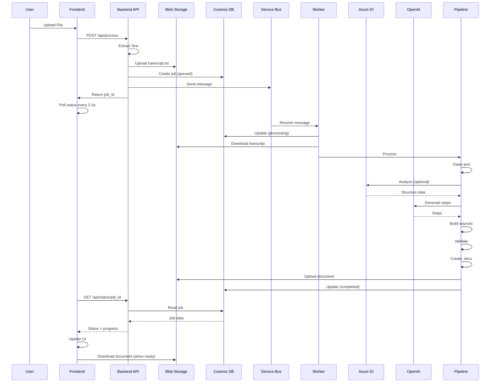

# ScriptToDoc Processing Flow - Simplified View

This is a simplified view focusing on key decision points and potential issues.

## Simplified Processing Flow

```mermaid
flowchart LR
    subgraph Frontend["Frontend (React/Next.js)"]
        A[User Uploads File] --> B[Validate File]
        B --> C[POST /api/process]
        C --> D[Poll Status Every 2-3s]
        D --> E{Status?}
        E -->|processing| D
        E -->|completed| F[Show Download]
        E -->|failed| G[Show Error]
    end
    
    subgraph Backend["Backend API (FastAPI)"]
        C --> H[Extract Text<br/>PDF or TXT]
        H --> I[Upload to Blob<br/>uploads/]
        I --> J[Create Job in<br/>Cosmos DB]
        J --> K{Processing<br/>Mode?}
        K -->|Direct| L[Background Thread]
        K -->|Queue| M[Service Bus]
    end
    
    subgraph Worker["Background Worker"]
        M --> N[Receive Message]
        L --> N
        N --> O[Download Transcript]
        O --> P[Run Pipeline]
    end
    
    subgraph Pipeline["Processing Pipeline"]
        P --> Q1[1. Clean Text]
        Q1 --> Q2[2. Azure DI<br/>Optional]
        Q2 --> Q3[3. Determine<br/>Step Count]
        Q3 --> Q4{OpenAI<br/>Configured?}
        Q4 -->|No| QError[Error:<br/>OpenAI Required]
        Q4 -->|Yes| Q5[4. Try Azure OpenAI<br/>GPT-4o-mini]
        Q5 --> Q5a{Azure OpenAI<br/>Success?}
        Q5a -->|Yes| Q7[5. Build Sources]
        Q5a -->|No| Q6[4. Try OpenAI Fallback<br/>GPT-4o-mini]
        Q6 --> Q6a{OpenAI<br/>Success?}
        Q6a -->|Yes| Q7
        Q6a -->|No| QError
        Q7 --> Q8[6. Validate]
        Q8 --> Q9[7. Create .docx]
        Q9 --> Q10[8. Upload to Blob<br/>documents/]
        Q10 --> Q11[9. Update Status<br/>completed]
    end
    
    Q11 --> D
    
    style A fill:#2563eb,stroke:#1e40af,stroke-width:2px,color:#fff
    style F fill:#16a34a,stroke:#15803d,stroke-width:2px,color:#fff
    style G fill:#dc2626,stroke:#b91c1c,stroke-width:2px,color:#fff
    style Q4 fill:#f59e0b,stroke:#d97706,stroke-width:2px,color:#fff
    style Q5 fill:#3b82f6,stroke:#2563eb,stroke-width:2px,color:#fff
    style Q5a fill:#f59e0b,stroke:#d97706,stroke-width:2px,color:#fff
    style Q6 fill:#3b82f6,stroke:#2563eb,stroke-width:2px,color:#fff
    style Q6a fill:#f59e0b,stroke:#d97706,stroke-width:2px,color:#fff
    style QError fill:#dc2626,stroke:#b91c1c,stroke-width:2px,color:#fff
```

## Key Decision Points & Potential Issues

### 1. File Upload & Validation
**Decision**: Validate file size and type before processing
**Potential Issues**:
- Large files may timeout
- PDF extraction may fail on corrupted files
- Encoding issues with .txt files

### 2. Processing Mode Selection
**Decision**: Direct processing vs Service Bus queue
**Potential Issues**:
- Direct processing blocks API thread
- Service Bus may be unavailable (falls back to direct)
- No retry mechanism if direct processing fails

### 3. Azure DI Analysis
**Decision**: Use Azure DI or skip
**Potential Issues**:
- Azure DI requires blob URL (not raw text)
- May fail silently and fall back to empty structure
- Adds latency but improves structure extraction

### 4. LLM Step Generation
**Decision**: Use Azure OpenAI (primary) or OpenAI (fallback)
**Potential Issues**:
- Azure OpenAI API may be rate-limited or unavailable
- OpenAI fallback may also fail (same underlying service)
- Token costs for large transcripts
- No retry on transient failures
- **No non-LLM fallback** - system requires LLM capabilities

### 5. Source Validation
**Decision**: Validate step sources or accept all
**Potential Issues**:
- Low confidence steps may be rejected
- Fallback mode may have poor source matching
- Could result in 0 valid steps

### 6. Document Generation
**Decision**: Generate .docx with python-docx
**Potential Issues**:
- File generation may fail
- Large documents may be slow
- Memory issues with very large documents

## Data Flow

## Component Responsibilities

### Frontend
- File validation (size, type)
- Upload with config (tone, audience, steps)
- Status polling
- Progress display
- Document download

### Backend API
- File extraction (PDF/TXT)
- Blob storage upload
- Cosmos DB job creation
- Service Bus message sending
- Direct processing fallback

### Background Worker
- Service Bus message consumption
- Transcript download
- Pipeline orchestration
- Status updates
- Error handling

### Pipeline
- Text cleaning
- Azure DI integration
- OpenAI integration
- Step generation
- Source matching
- Validation
- Document generation

## Potential Improvements

1. **Retry Logic**: Add retry for transient failures
2. **Queue Monitoring**: Better Service Bus health checks
3. **Source Matching**: Improve fallback source matching
4. **Error Recovery**: Partial results on partial failures
5. **Caching**: Cache Azure DI results for similar transcripts
6. **Streaming**: Stream large file uploads
7. **Webhooks**: Push updates instead of polling
8. **Batch Processing**: Process multiple files together

